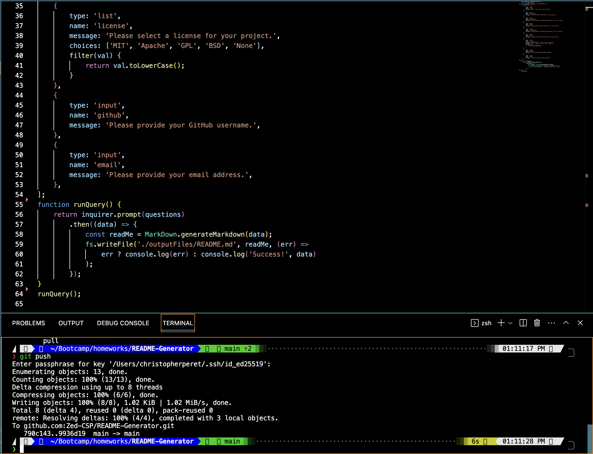

```
        # README Generator

        ## Table of Contents
        * [Installation](#installation)
        * [Usage](#usage)
        * [License](#license)
        * [Contributing](#contributing)
        * [Tests](#tests)
        * [Questions](#questions)

        ## Description
        Readme generator created in Node.js

        ## Installation
        Download repo to chosen directory. initialize node in your terminal with "npm init -y". 
        
        ## Usage
        Use the Prompts to create a boilerplate README.md file with the proper markdown quickly. Files are outputted to the "outputFiles" folder.
        
        
        ## License
        mit
        
        ## Contributing
        contact via github with suggestions.
        
        ## Tests
        Run the app, Fill in the prompts.
        
        ## Questions
        
        N/A
        Zed-CSP
        
 ```
